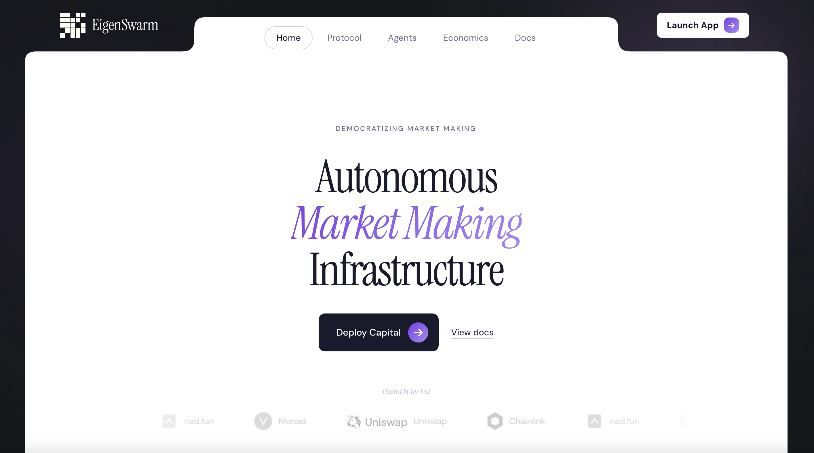

<p align="center">
  
</p>

<h1 align="center">EigenSwarm</h1>

<p align="center">
  <strong>Autonomous market-making infrastructure on Monad.</strong><br/>
  Institutional-grade liquidity for every token — starting at 1 USDC.
</p>

<p align="center">
  <a href="https://moltiverse.dev/"></a>
  <a href="https://monadscan.com/address/0x1003EdcD563Dcae3Bc1685b901fc692bbD2d941b"></a>
  <a href="https://nad.fun"></a>
</p>

<p align="center">
  <code>x402 Payments</code> &middot; <code>ERC-8004 Agent Identity</code> &middot; <code>nad.fun Atomic Launch</code> &middot; <code>Uniswap V4</code>
</p>

---

## The Problem

Volume is the lifeblood of any chain. But across DeFi, the vast majority of tokens suffer from **stale orderbooks, thin liquidity, and dead markets**.

Professional market makers serve only the top 1% of tokens — those with enough capital to pay six-figure retainers. Everyone else gets nothing: wide spreads, zero depth, and tokens that look abandoned within hours of launch.

On Monad, with 400ms blocks and sub-cent gas, we finally have infrastructure fast enough for real market making at scale. But without accessible MM tooling, most tokens launched on nad.fun still face the same liquidity desert. Creators launch, buy their own bags, and watch volume flatline.

> **Monad's throughput advantage goes underutilized, and nad.fun tokens die on the vine.**

## The Solution

EigenSwarm gives **every token on Monad access to autonomous market-making agents** — the same buy/sell cycling, spread capture, and liquidity provision that institutional MMs provide, but available to anyone for as little as **1 USDC**.

Add an agent. It trades. It earns. It registers its own on-chain identity. It can even pay for itself.

**No retainers. No whitelists. No humans in the loop.**

---

## Why Monad Needs This

| | Problem | EigenSwarm |
|---|---------|-----------|
| **Volume** | Tokens launch on nad.fun with no sustained activity | Agents generate continuous buy/sell volume from minute one |
| **Liquidity** | Thin depth = high slippage = users leave | Multi-wallet agents create depth across bonding curves + V4 pools |
| **Chain Metrics** | Volume is the #1 health metric; stale markets hurt Monad | Every token becomes an active market, boosting chain-wide volume |
| **Access** | Market making is gatekept behind institutional capital | Anyone can add an agent for 1 USDC — fully democratized |
| **Graduation** | Bonding curve to DEX transition kills momentum | Agents auto-detect graduation and seamlessly switch to Uniswap V4 |
| **Trust** | No way to verify if a "market maker" is legit | ERC-8004 identity + on-chain reputation = verifiable performance |

---

## Hackathon Alignment

EigenSwarm is purpose-built for the [MOLTIVERSE](https://moltiverse.dev/) thesis: **what happens when AI agents can transact at scale on a high-performance blockchain.**

<table>
<tr>
<td width="50%">

### Agent+Token Track
- Agents launch tokens on **nad.fun** with atomic market maker deployment (one tx: token + LP + agent)
- Generate real volume and community activity — turning creator fees into agent economy revenue
- Live dashboard showing agent P&L, trades, and volume in real-time

</td>
<td width="50%">

### Agent-to-Agent (A2A)
- Any AI agent can pay via **x402** and spin up a market maker — **just an HTTP request + USDC transfer**
- Agents register on-chain via **ERC-8004** — discoverable and composable by other agents
- Daily reputation signals: win rate, volume, P&L — all verifiable on-chain

</td>
</tr>
</table>

**Technologies**: Monad (L1) &middot; nad.fun (bonding curves) &middot; x402 (agent payments) &middot; ERC-8004 (agent identity) &middot; Uniswap V4 (LP + trading)

---

## Features

### Autonomous Market Making
Each agent ("eigen") is an autonomous market maker that:
- Operates from an on-chain vault (**EigenVault**) with isolated funds
- Controls **1–50 sub-wallets** to distribute trading activity across addresses
- Executes buy/sell cycles on **nad.fun bonding curves** and **Uniswap V4** pools
- Tracks P&L, win rate, and volume in real-time
- Seeds and compounds V4 LP positions for fee revenue
- Auto-detects **graduation** and transitions from bonding curve to DEX trading

### ERC-8004 — Trustless Agent Identity
Agents register as NFTs on the [ERC-8004](https://github.com/sudeepb02/awesome-erc8004) Identity Registry:
- Verifiable on-chain identity (`agentId` as an NFT token ID)
- Published agent card with trading stats, service endpoints, and class
- Daily reputation signals posted to the Reputation Registry
- Transferable ownership — transfer the NFT, transfer the agent

### x402 — Autonomous Agent Payments

EigenSwarm implements the [x402 payment protocol](https://docs.monad.xyz/guides/x402-guide) — the HTTP `402 Payment Required` standard that lets any AI agent pay for services with USDC, no API keys or human approval needed.

**Why x402 matters:** Traditional APIs require signup, API keys, and billing accounts. x402 flips this — any agent with a wallet and USDC can consume the EigenSwarm API instantly. This is how agent-to-agent commerce works on Monad.

**The flow:**

```
┌─────────────────────────────────────────────────────────────────────┐
│                         x402 Payment Flow                           │
├─────────────────────────────────────────────────────────────────────┤
│                                                                     │
│  Agent                           Keeper API                         │
│    │                                │                               │
│    ├─ POST /api/agents/buy-volume ──►│                              │
│    │  { tokenAddress, packageId }    │                              │
│    │                                 │                              │
│    │◄── 402 Payment Required ────────┤                              │
│    │  { amount: "10", token: "USDC", │                              │
│    │    recipient: "0x...",           │                              │
│    │    chain: "monad" }             │                              │
│    │                                 │                              │
│    ├─ USDC.transfer(recipient, 10) ──► Monad (400ms confirmation)  │
│    │  tx: 0xabc123...               │                               │
│    │                                 │                              │
│    ├─ POST /api/agents/buy-volume ──►│                              │
│    │  + header X-PAYMENT: 0xabc123   │                              │
│    │                                 ├─ Verify USDC transfer        │
│    │                                 ├─ Swap USDC → MON (treasury)  │
│    │                                 ├─ Fund EigenVault             │
│    │                                 ├─ Spin up trading agent       │
│    │◄── 201 Created ────────────────┤                               │
│    │  { eigenId: "ES-a1f2",         │                               │
│    │    status: "active",            │                              │
│    │    funding: { funded: true } }  │                              │
│                                                                     │
└─────────────────────────────────────────────────────────────────────┘
```

**Two x402-powered operations:**

| Operation | Endpoint | What happens |
|-----------|----------|-------------|
| **Buy Volume** | `POST /api/agents/buy-volume` | Pay USDC → market-making agent added to any existing nad.fun token |
| **Launch Token** | `POST /api/launch` | Pay USDC → new token created on nad.fun + LP seeded + agent starts trading |

**Payment verification:** The keeper verifies the USDC transfer on-chain via ERC-20 Transfer event logs on Monad (chain ID 143). No third-party facilitator required — fully trustless verification against the Monad RPC.

**What this enables:** An AI agent running autonomously can discover a promising nad.fun token, pay 10 USDC via a single HTTP flow, and have a market maker live and trading within seconds — all without a human ever being involved. This is the first implementation of x402-powered market making infrastructure on Monad.

### Atomic Token Launch on nad.fun
Launch a new token with market making in **a single atomic transaction**:
- Create token on nad.fun bonding curve
- Execute initial dev buy
- Seed Uniswap V4 LP position
- Spin up autonomous market-making agent

Or add a market maker to **any existing nad.fun token** — just provide the token address and pick a volume package.

---

## Architecture

```
                    ┌──────────────────┐
                    │   Frontend (web)  │  Next.js 14 / React / Tailwind
                    │   port 3000       │  Privy auth + wagmi
                    └────────┬─────────┘
                             │
                    ┌────────▼─────────┐
                    │  Keeper Service   │  Node.js / TypeScript
                    │  port 3001        │  Trading engine + API + x402
                    └──┬─────┬─────┬───┘
                       │     │     │
              ┌────────▼┐ ┌──▼───┐ ├──────────────────┐
              │ Indexer  │ │Vault │ │ nad.fun Bonding   │
              │ (Ponder) │ │ + LP │ │ Curve + Uniswap   │
              └──────────┘ └──────┘ └──────────────────┘
                             │
                    ┌────────▼─────────┐
                    │   Monad (L1)     │  400ms blocks
                    │   Chain ID: 143  │
                    └──────────────────┘
```

### Monorepo

```
eigenswarm/
├── apps/
│   ├── web/             # Next.js frontend — dashboard, agents, launch, monitoring
│   ├── keeper/          # Core service — trading engine, x402 payments, ERC-8004
│   ├── indexer/         # Ponder indexer — on-chain event aggregation (GraphQL)
│   └── tg-sniper/       # Telegram bot — trade alerts and monitoring
├── packages/
│   ├── sdk/             # TypeScript SDK — client library for the keeper API
│   └── shared/          # Shared types, ABIs, chain configs, constants
├── contracts/           # Solidity smart contracts (Forge)
│   ├── EigenVault.sol       # Holds deposits, manages eigen accounts, tracks fees
│   ├── EigenLP.sol          # Seeds and manages Uniswap V4 LP positions
│   ├── EigenAtomicLauncher.sol  # One-tx: token + LP + vault on nad.fun
│   └── EigenLauncher.sol    # Creates eigens in vault with initial funding
└── examples/
    ├── autonomous-agent.ts  # Full x402 flow — agent pays for itself
    └── agent-launch.ts      # SDK-based launch with monitoring
```

---

## Agent Classes

| | Class | Volume/Day | Trades/Hr | Order Size | Wallets | Min Deposit | Fee |
|---|-------|-----------|-----------|-----------|---------|-------------|-----|
| **Lite** | `sentinel` | 0.5–2 ETH | 1–30 | 0.001–0.01 ETH | 1–5 | 0.001 ETH | 3% |
| **Core** | `operator` | 2–10 ETH | 5–40 | 0.01–0.1 ETH | 5–20 | 0.01 ETH | 4% |
| **Pro** | `architect` | 10–30 ETH | 10–50 | 0.1–0.5 ETH | 20–40 | 0.05 ETH | 5% |
| **Ultra** | `sovereign` | 30–100+ ETH | 30–100 | 0.5–2 ETH | 40–50 | 0.1 ETH | 5% |

## x402 Volume Packages

| Package | Volume | Price |
|---------|--------|-------|
| **micro** | 0.05 ETH | 1 USDC |
| **mini** | 0.1 ETH | 2 USDC |
| **starter** | 1 ETH | 10 USDC |
| **growth** | 5 ETH | 40 USDC |
| **pro** | 20 ETH | 120 USDC |
| **whale** | 100 ETH | 500 USDC |

---

## Deployed Contracts

### Monad (Chain ID: 143)

| Contract | Address | Explorer |
|----------|---------|----------|
| **EigenVault** | `0x1003EdcD563Dcae3Bc1685b901fc692bbD2d941b` | [View on Monadscan](https://monadscan.com/address/0x1003EdcD563Dcae3Bc1685b901fc692bbD2d941b) | **EigenSwarm** | 0x2Bb7dac00eFaC28c3B76A1D72757C65C38eF7777| [View on Monadscan](https://monadscan.com/address/0x2Bb7dac00eFaC28c3B76A1D72757C65C38eF7777) 
| **EigenLP** | `0xEf8b421B15Dd0Aa59392431753029A184F3eEc54` | [View on Monadscan](https://monadscan.com/address/0xEf8b421B15Dd0Aa59392431753029A184F3eEc54) |
| **EigenAtomicLauncher** | `0x9920E8900a154Da216d56F005156FA354835CDAE` | [View on Monadscan](https://monadscan.com/address/0x9920E8900a154Da216d56F005156FA354835CDAE) |

### ERC-8004 Registries (Monad)

| Registry | Address | Explorer |
|----------|---------|----------|
| **Identity Registry** | `0x8004A169FB4a3325136EB29fA0ceB6D2e539a432` | [View on Monadscan](https://monadscan.com/address/0x8004A169FB4a3325136EB29fA0ceB6D2e539a432) |
| **Reputation Registry** | `0x8004BAa17C55a88189AE136b182e5fdA19dE9b63` | [View on Monadscan](https://monadscan.com/address/0x8004BAa17C55a88189AE136b182e5fdA19dE9b63) |

---

## Quick Start

### Prerequisites

- Node.js 20+
- [pnpm](https://pnpm.io/) 9+
- Monad RPC access

### Install & Run

```bash
git clone https://github.com/your-org/EigenSwarm_Monad.git
cd EigenSwarm_Monad
pnpm install
pnpm dev
```

| Service | URL |
|---------|-----|
| Frontend | http://localhost:3000 |
| Keeper API | http://localhost:3001 |

<details>
<summary><strong>Environment Variables</strong></summary>

**`apps/web/.env.local`**
```env
NEXT_PUBLIC_EIGENVAULT_ADDRESS=0x1003EdcD563Dcae3Bc1685b901fc692bbD2d941b
NEXT_PUBLIC_EIGENLP_ADDRESS=0xEf8b421B15Dd0Aa59392431753029A184F3eEc54
NEXT_PUBLIC_WALLETCONNECT_PROJECT_ID=your_project_id
NEXT_PUBLIC_PRIVY_APP_ID=your_privy_app_id
NEXT_PUBLIC_KEEPER_API_URL=http://localhost:3001
```

**`apps/keeper/.env`**
```env
PRIVATE_KEY=0x...              # Keeper wallet private key
MONAD_RPC_URL=https://rpc.monad.xyz
X402_PAY_TO=0x...              # Address to receive USDC payments
```
</details>

---

## SDK

```typescript
import { EigenSwarmClient } from '@eigenswarm/sdk';

const client = new EigenSwarmClient({
  keeperUrl: 'https://api.eigenswarm.xyz',
  apiKey: 'esk_abc123...',
  chainId: 143, // Monad
});

// Add a market maker to any nad.fun token
const result = await client.buyVolume(
  '0x...tokenAddress',
  'starter',        // 1 ETH volume, 10 USDC
  '0x...usdcTxHash' // proof of USDC payment
);
console.log(`Eigen ${result.eigenId} is now trading`);

// Monitor P&L
const pnl = await client.getPnL(result.eigenId);
console.log(`Realized: ${pnl.totalRealizedPnl} ETH`);

// Take profit
await client.takeProfit(result.eigenId, 50); // sell 50% of positions
```

<details>
<summary><strong>Launch a New Token + Market Maker</strong></summary>

```typescript
const launch = await client.launch({
  name: 'My Token',
  symbol: 'MTK',
  packageId: 'growth',
  description: 'A token with built-in market making',
}, '0x...usdcTxHash');

console.log(`Token: ${launch.tokenAddress}`);
console.log(`Pool: ${launch.poolId}`);
console.log(`Eigen: ${launch.eigenId}`);
```
</details>

---

## Autonomous Agent Example

An agent that pays for itself — **no human in the loop**:

```bash
# Add a market maker to an existing nad.fun token
AGENT_PRIVATE_KEY=0x... TOKEN_ADDRESS=0x... npx tsx examples/autonomous-agent.ts

# Launch a brand new token with market making
AGENT_PRIVATE_KEY=0x... TOKEN_NAME="My Token" TOKEN_SYMBOL="MTK" \
npx tsx examples/autonomous-agent.ts --launch
```

**What the agent does autonomously:**

```
[1] Check USDC + MON balance
[2] Verify keeper is healthy
[3] Request payment instructions (HTTP 402)
[4] Send USDC on-chain as payment
[5] Submit proof → eigen created and funded
[6] Monitor trades and P&L every 30s
```

---

## API Reference

<details>
<summary><strong>Keeper API Endpoints</strong></summary>

| Method | Endpoint | Description |
|--------|----------|-------------|
| `GET` | `/api/health` | Keeper health and gas status |
| `GET` | `/api/pricing` | Volume packages and payment info |
| `GET` | `/api/chains` | Supported chains |
| `POST` | `/api/agents/buy-volume` | Purchase volume (x402 flow) |
| `POST` | `/api/launch` | Launch token + LP + eigen (x402) |
| `GET` | `/api/eigens/:id` | Eigen status and config |
| `GET` | `/api/eigens/:id/trades` | Trade history |
| `GET` | `/api/eigens/:id/pnl` | P&L breakdown |
| `GET` | `/api/eigens/:id/positions` | Current token positions |
| `POST` | `/api/agent/eigens/:id/take-profit` | Sell positions |
| `POST` | `/api/agent/eigens/:id/liquidate` | Full liquidation |
| `POST` | `/api/agent/eigens/:id/fund` | Fund eigen (x402) |
| `POST` | `/api/agent/keys` | Get API key (EIP-191) |

</details>

---

## How It Works

```
User / AI Agent
      │
      ├─ 1. POST /api/agents/buy-volume
      │      → 402: "Send 10 USDC to 0x..."
      │
      ├─ 2. Send USDC on-chain (Monad, 400ms)
      │
      ├─ 3. POST /api/agents/buy-volume + X-PAYMENT: 0xtxhash
      │      → 201: { eigenId: "ES-a1f2", status: "active" }
      │
      │   ┌──────── Keeper auto-funds and starts trading ────────┐
      │   │                                                       │
      │   │  EigenVault ← MON deposit                            │
      │   │      ├── Wallet 1 → buy on nad.fun                  │
      │   │      ├── Wallet 2 → sell on nad.fun                 │
      │   │      ├── Wallet 3 → swap on Uniswap V4             │
      │   │      └── ...up to 50 wallets                        │
      │   │                                                       │
      │   │  EigenLP ← Seed V4 liquidity → compound fees        │
      │   │  ERC-8004 ← Register identity → post reputation     │
      │   └───────────────────────────────────────────────────────┘
      │
      ├─ 4. GET /api/eigens/ES-a1f2/pnl
      │      → { realizedPnl: 0.31, winRate: 0.73 }
      │
      └─ 5. POST /take-profit → sells positions, MON to vault
```

---

## Tech Stack

| Layer | Technology |
|-------|-----------|
| **Blockchain** | Monad (L1, 400ms blocks) |
| **Contracts** | Solidity, Forge |
| **Backend** | Node.js, TypeScript, better-sqlite3 |
| **Frontend** | Next.js 14, React 18, Tailwind CSS |
| **Auth** | Privy, WalletConnect, wagmi |
| **DEX** | Uniswap V4, nad.fun bonding curves |
| **Indexing** | Ponder (GraphQL) |
| **Agent Identity** | ERC-8004 (Identity + Reputation) |
| **Payments** | x402 protocol (USDC) |
| **Monorepo** | Turborepo, pnpm workspaces |

---

<p align="center">
  <strong>EigenSwarm</strong> &mdash; Democratizing market making on Monad.<br/>
  Built for <a href="https://moltiverse.dev/">MOLTIVERSE</a>.
</p>
